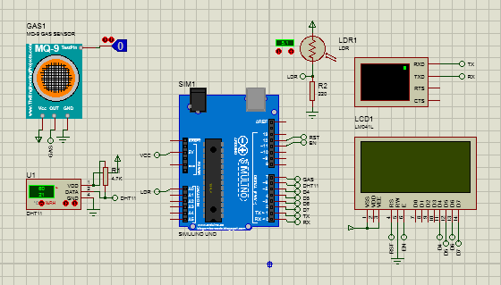

# Free-RTOS Plant Monitoring 
Plant montoring system utilizing real time operating system [FreeRTOS](https://www.freertos.org/)

## Info
- Still work in progress.
- Proteus project included for simulation purpose
- Proteus version is 8.6 SP 2 
- Compiled binary included for ease of use

## What's working now
- Temp sensor and LCD

## Issues
- If `lcd_task` has higher priority than other task (currently `dht11_task`), sensor reading will throw `DHTlib_error_timeout`, this can be solved by setting the priority for lcd task lower than other, but LCD data update will show noticeable delay

## Component 
- Arduino UNO
- ~~TMP36~~
- DHT11
- LCD 16x4
- More component soon

## Task
1. LCD Task (`lcd_task`)
2. DHT11 Task (`dht11_task`)

## Todo
- [x] Humidity sensor (DHT11, TMP36 will be replaced)
- [ ] Soil Moisture sensor (SEN-13322)
- [ ] Sunlight sensor (LDR)
- [ ] Actuator (DC motor and servo)

## Simulation
